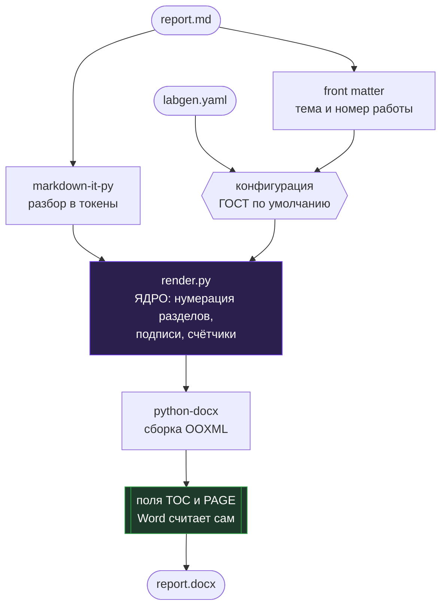

<div align="center">

# 📄 labgen

**Пишете отчёт в Markdown — получаете DOCX, оформленный по ГОСТ 7.32-2017.**

[](#-что-labgen-делает-с-вашим-markdown)
[](#-быстрый-старт)
[](https://github.com/logreus-cloud/labgen/actions/workflows/ci.yml)
[](#-как-устроено)
[](LICENSE)

[Быстрый старт](#-быстрый-старт) · [Синтаксис](#-что-labgen-делает-с-вашим-markdown) · [Настройка](#-настройка-оформления) · [Как устроено](#-как-устроено) · [Roadmap](#-roadmap)

</div>

---

## 📌 Проблема

> Работа сделана, текст написан, скриншоты собраны. Остаётся «просто оформить» — и на это уходит ещё один вечер.

- **Стили руками.** Times New Roman 14, интервал 1,5, отступ 1,25 см, поля 30/15/20/20 — и всё это заново в каждом новом файле.
- **Нумерация, которая разъезжается.** Вставили рисунок в середину — перенумеровать нужно все следующие подписи и все ссылки на них в тексте.
- **Содержание, которое живёт своей жизнью.** Собрали в начале, дописали раздел, забыли обновить — и номера страниц врут.
- **Правки после сдачи.** Преподаватель просит поменять формулировку в третьем разделе, и вы снова открываете Word вместо того, чтобы поправить одну строку.

Оформление съедает столько же времени, сколько сама работа, и при этом не имеет к ней никакого отношения.

## 💡 Решение

labgen забирает оформление на себя: вы пишете содержание в обычном Markdown, он отдаёт документ, который можно сдавать.

| | Было | Стало с labgen |
|---|---|---|
| Оформление новой лабы | ~2 часа возни со стилями | `labgen build report.md`, 1 секунда |
| Вставить рисунок в середину | перенумеровать все следующие подписи | пересобрать — номера пересчитаются |
| Содержание | собрать руками и не забыть обновить | поле `TOC`, Word собирает сам |
| Требования кафедры | помнить и применять каждый раз | пять строк в `labgen.yaml` |
| История правок | `отчёт_v3_финал_испр2.docx` | обычный git-diff по тексту |

## ✨ Возможности

- 🔢 **Сквозная нумерация** рисунков, таблиц, листингов и разделов — пересчитывается при каждой сборке, вручную не трогается вообще.
- 🎓 **Титульный лист из конфига** — данные кафедры один раз на семестр, тема и номер работы прямо в отчёте.
- 📑 **Содержание и номера страниц полями Word** — живые, а не вбитые текстом; титульный лист входит в нумерацию, но номера на нём нет.
- 🖼 **Рисунки по месту** — ужимаются до ширины текста, подпись берётся из alt-текста.
- ⚙️ **Настраиваемо целиком** — значения по умолчанию соответствуют стандарту, требования конкретной кафедры кладутся поверх.
- 🚫 **Без Word, LaTeX и Pandoc** — только Python, работает на Windows, Linux и macOS одинаково.

## ⚡ Быстрый старт

```bash
pip install labgen
labgen init
```

`init` создаст `labgen.yaml`, заготовку `report.md` и папку `images/`.
Заполните конфигурацию — один раз на весь семестр:

```yaml
title_page:
  university: ФГБОУ ВО «Название университета»
  faculty: Факультет информационных технологий
  department: Кафедра программной инженерии
  discipline: Базы данных
  author:     { name: Иванов И. И., group: ПИ-21 }
  supervisor: { name: Петров П. П., position: доцент, к.т.н. }
  city: Москва
  year: 2026
```

Тема и номер работы меняются от лабы к лабе — их удобно держать в самом отчёте:

```markdown
---
work_kind: по лабораторной работе № 3
topic: Проектирование схемы данных в MongoDB
---

# Введение

Цель работы — ...
```

Собрать:

```console
$ labgen build report.md
  конфигурация: labgen.yaml
  + report.docx
  рисунков: 4, таблиц: 2, листингов: 3
```

Откройте `report.docx` и нажмите **F9** — Word соберёт содержание.

<details>
<summary><b>Установка из исходников</b></summary>

```bash
git clone https://github.com/logreus-cloud/labgen
cd labgen
pip install -e ".[dev]"
pytest -q
```

</details>

## 📝 Что labgen делает с вашим Markdown

| В Markdown | В документе |
|---|---|
| `# Теоретическая часть` | «1 Теоретическая часть» — с новой страницы, полужирным |
| `## Основные понятия` | «1.1 Основные понятия» |
| `# Введение`, `# Заключение` | без номера — список таких заголовков настраивается |
| `` | рисунок по центру, ужатый до ширины текста, + «Рисунок 1 — Схема алгоритма» |
| строка `Таблица: Замеры` перед таблицей | «Таблица 2 — Замеры» слева над таблицей |
| строка `Листинг: Подключение к БД` перед кодом | «Листинг 1 — Подключение к БД», код — Courier New 12 пт |
| ```` ```python caption="Сортировка" ```` | то же самое, подпись прямо в блоке кода |
| `- пункт` | перечисление через тире, с абзацного отступа |
| `**жирный**`, `*курсив*`, `` `код` `` | сохраняются |

Нумерация сквозная по всему документу. Вставили рисунок в середину — просто соберите заново.

## 🏗 Как устроено



<details>
<summary><b>Почему так</b></summary>

- **Содержание и номера страниц — поля OOXML, а не текст.** Word пересобирает их сам, поэтому документ остаётся живым и после ваших правок прямо в нём.
- **Заголовки используют встроенные стили `Heading N`,** переопределённые под ГОСТ. За счёт этого работает и навигация по документу, и автосборка содержания — самописный стиль их сломал бы.
- **Гарнитура проставляется во всех четырёх слотах `w:rFonts`.** Иначе кириллица в Word может отрисоваться шрифтом темы вместо заданного — классическая ловушка генераторов docx.
- **Значения по умолчанию равны стандарту.** Всё, что расходится с ГОСТом, живёт в `labgen.yaml` пользователя, а не в коде.
- **Никакого Word, LaTeX и Pandoc в зависимостях.** `git clone` → `pip install` → рабочий документ, на любой ОС.

</details>

## ⚙️ Настройка оформления

Требования кафедр расходятся с ГОСТом — почти всё в `format` правится:

```yaml
format:
  font: Times New Roman
  size: 14
  line_spacing: 1.5
  first_line_indent: 1.25                              # абзацный отступ, см
  margins: {left: 30, right: 15, top: 20, bottom: 20}  # поля страницы, мм
  page_numbers: true
  page_number_position: bottom-center   # bottom-center | bottom-right | top-center | top-right
  section_page_break: true              # каждый раздел с новой страницы
  number_headings: true                 # автонумерация 1, 1.1, 1.1.1
  unnumbered_headings: [введение, заключение, список использованных источников]
  code: {font: Courier New, size: 12, line_spacing: 1.0}
  table: {size: 12}
  captions: {figure: Рисунок, table: Таблица, listing: Листинг, dash: '—'}
```

<details>
<summary><b>Например: правое поле 10 мм и разделы подряд</b></summary>

```yaml
format:
  margins: {left: 30, right: 10, top: 20, bottom: 20}
  section_page_break: false
```

</details>

Конфигурация ищется сама: рядом с md-файлом, затем в текущем каталоге.

## 🧰 Стек

| Слой | Технологии |
|---|---|
| CLI | Python 3.10+, Click |
| Разбор Markdown | markdown-it-py (CommonMark + таблицы) |
| Сборка документа | python-docx + прямые правки OOXML для полей |
| Конфигурация | YAML |
| Тесты | pytest — 21 тест, проверяют получившийся документ |
| CI | GitHub Actions: Ubuntu и Windows × Python 3.10–3.13, ruff |

## 📟 Команды

```
labgen init [КАТАЛОГ] [--force]   создать labgen.yaml, report.md и images/
labgen build ИСХОДНИК.md          собрать документ
    -o, --output ФАЙЛ             куда сохранить (по умолчанию — рядом с исходником)
    -c, --config labgen.yaml      явный путь к конфигурации
    --title / --no-title          печатать титульный лист
    --toc / --no-toc              вставлять содержание
    --strict                      считать предупреждения ошибками (удобно в CI)
```

## 🗺 Roadmap

- [x] MVP: титульный лист, оформление по ГОСТ, автонумерация, содержание
- [x] Рисунки, таблицы и листинги со сквозными подписями
- [x] Конфигурация под требования кафедры
- [ ] Перекрёстные ссылки в тексте (`см. рисунок @fig:scheme`)
- [ ] Приложения с буквенной нумерацией (Приложение А)
- [ ] Формулы: LaTeX → OMML
- [ ] Список литературы из bib-файла
- [ ] Готовые `labgen.yaml` под конкретные вузы

Нужен формат, которого нет? [Заведите issue](https://github.com/logreus-cloud/labgen/issues) с требованиями вашей кафедры — приложите методичку, так быстрее всего.

## 📂 Структура

```
.
├── labgen/
│   ├── cli.py             две команды: init и build
│   ├── config.py          значения по умолчанию = ГОСТ, поверх — labgen.yaml
│   ├── render.py          ЯДРО: токены Markdown → абзацы, нумерация, подписи
│   ├── titlepage.py       титульный лист
│   ├── docxutil.py        поля OOXML, стили, шрифты, поля страницы
│   └── assets/            шаблоны для labgen init
├── tests/                 21 тест: проверяют документ, а не внутренности рендерера
└── .github/workflows/     CI на двух ОС и четырёх версиях Python
```

## 🤝 Участие в проекте

PR приветствуются — см. [CONTRIBUTING.md](CONTRIBUTING.md). Особенно полезны:

- **требования вашей кафедры**, если labgen оформляет что-то не так, — с методичкой в issue;
- **готовые `labgen.yaml`** под конкретные вузы;
- пункты из [Roadmap](#-roadmap).

## 📄 Лицензия

MIT — см. [LICENSE](LICENSE).

---

<div align="center">
Сделано, чтобы оформление отчёта занимало секунду, а не вечер 📄
</div>
